# BuildingMetricsDashboard
I will create dashboards that use multiple graphs to monitor our sample application that is deployed on a Kubernetes cluster. I will be using Prometheus, Jaeger, and Grafana in order to monitor, trace and visualize your experience. 
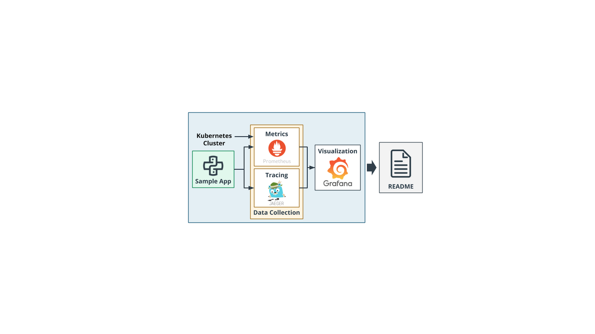

# Preparing Kubernetes
### Vagrant Up
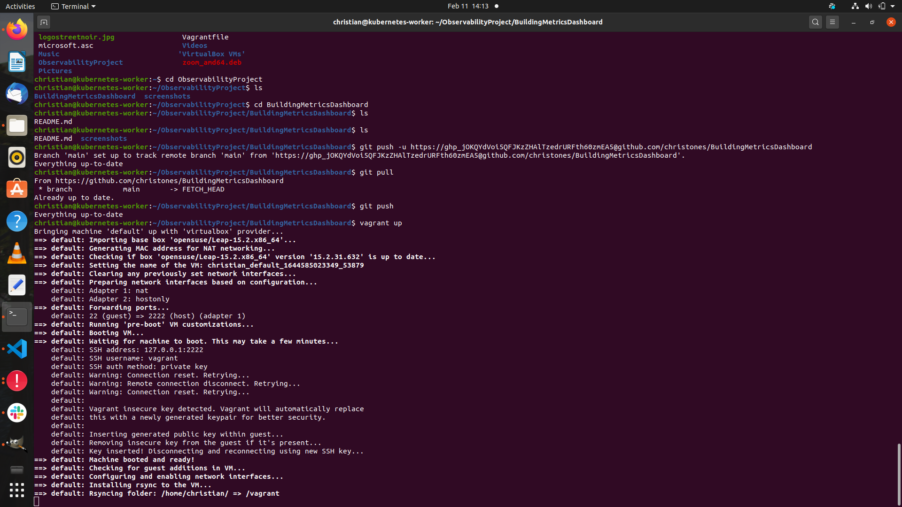
### Vagrant SSH
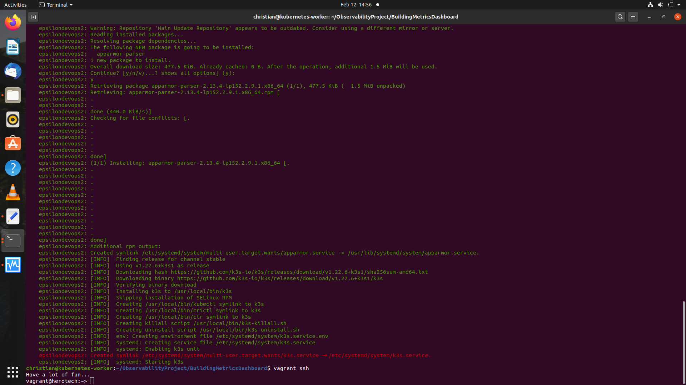
### Kube-context 
###### kubectl config use-context
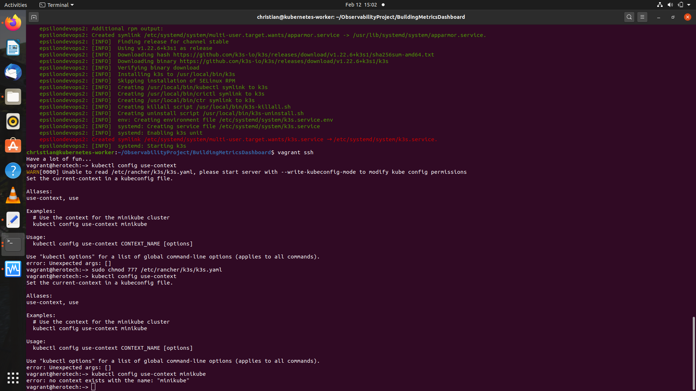
###### kubectl config view
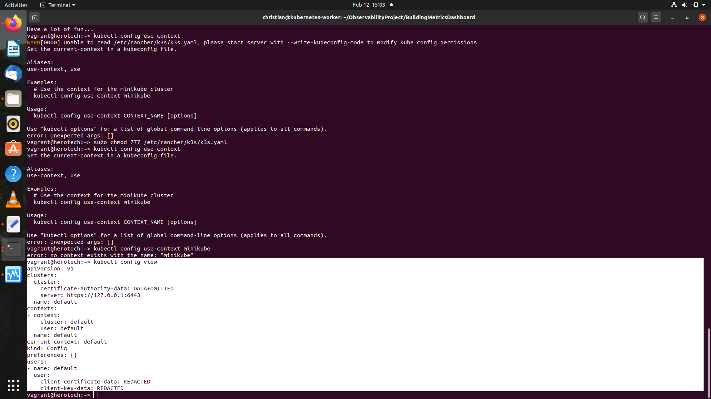

# Installing Helm
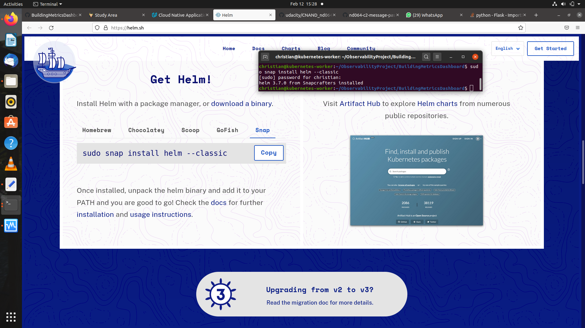

**Note:** For the other screenshots, i stored all of your answer images in the `answer-img` directory.

##### Verify the monitoring installation

*TODO:* run `kubectl` command to show the running pods and services for all components. 

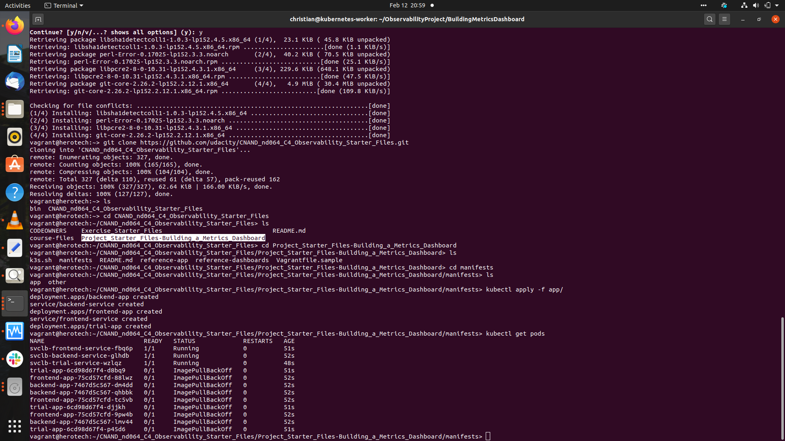

##### Setup the Jaeger and Prometheus source
*TODO:* Expose Grafana to the internet and then setup Prometheus as a data source. Provide a screenshot of the home page after logging into Grafana.
######## Installing Grafana and Prometheus

######## Installing Jaeger
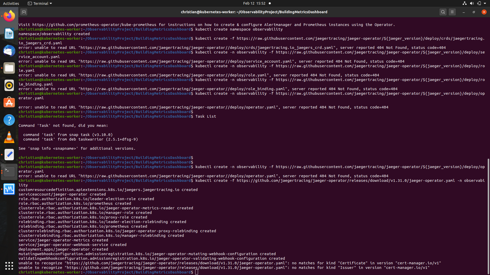
######## Deploying the starter project on localhost:8080 
########## kubectl apply -f app/
########## kubectl port-forward

##### Create a Basic Dashboard
*TODO:* Create a dashboard in Grafana that shows Prometheus as a source. Take a screenshot and include it here.
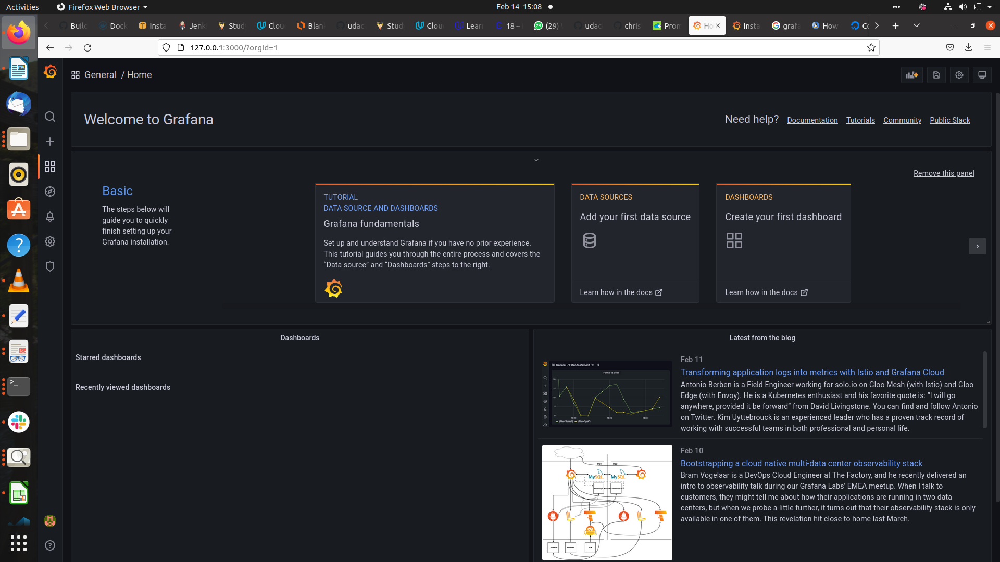
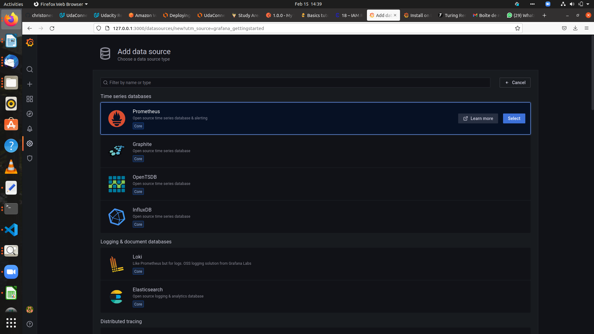
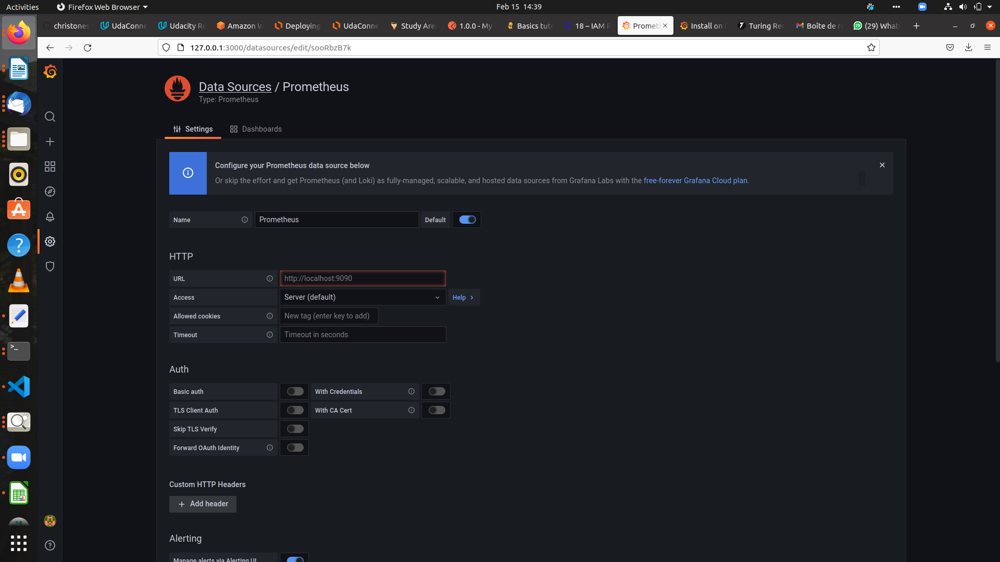

##### Describe SLO/SLI
*TODO:* Describe, in your own words, what the SLIs are, based on an SLO of *monthly uptime* and *request response time*.

####### SLIs 

SLIs stand for Service Level Indicators and are specific metrics used to measure the performance of a service. 

Example : The average time taken to return a request during the month of May was 194 ms.

####### SLO

An SLO stands for Service Level Objective and is a measurable goal set by the SRE team to ensure a standard level of performance during a specified period of time. 

Example : The application will have an uptime of 99.9% during the next year. 

##### Creating SLI metrics.
*TODO:* It is important to know why we want to measure certain metrics for our customer. Describe in detail 5 metrics to measure these SLIs. 
The five metrics are : 

Uptime : Time a service is active
Latency : Response time of requests
Errors : 100% - Uptime
Traffic : Network capacity or average bandwidth
CPU saturation : Total connected devices consumption 

##### Create a Dashboard to measure our SLIs
*TODO:* Create a dashboard to measure the uptime of the frontend and backend services We will also want to measure to measure 40x and 50x errors. Create a dashboard that show these values over a 24 hour period and take a screenshot.

##### Tracing our Flask App
*TODO:*  We will create a Jaeger span to measure the processes on the backend. Once you fill in the span, provide a screenshot of it here. Also provide a (screenshot) sample Python file containing a trace and span code used to perform Jaeger traces on the backend service.

##### Jaeger in Dashboards
*TODO:* Now that the trace is running, let's add the metric to our current Grafana dashboard. Once this is completed, provide a screenshot of it here.

##### Creating SLIs and SLOs
*TODO:* We want to create an SLO guaranteeing that our application has a 99.95% uptime per month. Name four SLIs that you would use to measure the success of this SLO.

##### Building KPIs for our plan
*TODO*: Now that we have our SLIs and SLOs, create a list of 2-3 KPIs to accurately measure these metrics as well as a description of why those KPIs were chosen. We will make a dashboard for this, but first write them down here.

##### Final Dashboard
*TODO*: Create a Dashboard containing graphs that capture all the metrics of your KPIs and adequately representing your SLIs and SLOs. Include a screenshot of the dashboard here, and write a text description of what graphs are represented in the dashboard.  
